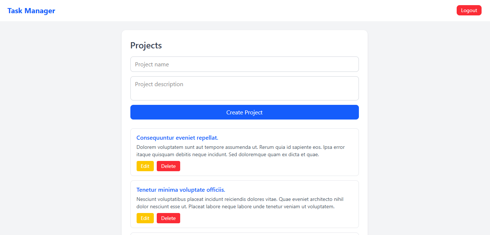
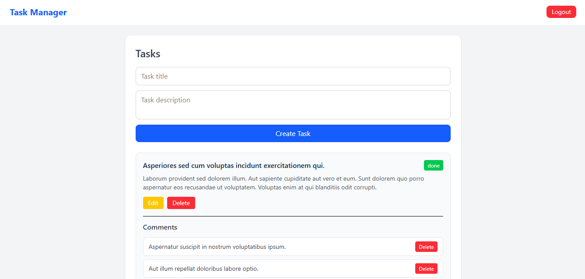
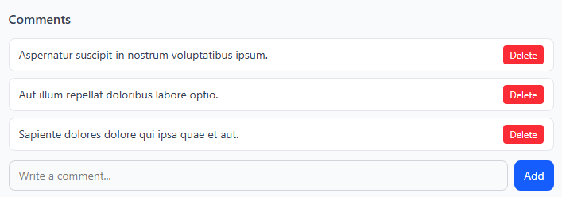

# Task Management Frontend

This project is the frontend for the Task Management System.
It provides a modern interface to manage **projects, tasks, and comments**.

Built as a portfolio project to demonstrate **fullstack development with React and Laravel API**.

---

# Tech Stack

Frontend:

* React
* Tailwind CSS
* Axios
* React Router
* Vite

Backend API:

Laravel REST API (separate repository)

---

# Features

Authentication

* Login using API token
* Token stored in localStorage

Projects

* Create project
* View project list
* Update project
* Delete project

Tasks

* Create task
* Update task
* Delete task
* View tasks by project

Comments

* Add comment to task
* View comments
* Delete comment

---

# Screenshots

## Projects list


## Tasks board


## Comments section


---

# Installation

Clone repository
```bash
git clone https://github.com/hadisubhana/task-manager-frontend
```
Install dependencies
```bash
npm install
```
Run development server
```bash
npm run dev
```
Open browser
```bash
http://localhost:5173
```
---

# Environment Configuration

Update API base URL in:

src/api/api.js

Example:

const api = axios.create({
baseURL: "https://your-api-url/api"
})

---

# Backend API

This frontend consumes the following API project:

Task Management API
https://github.com/hadisubhana/task-management-api

---

# Live Demo

Frontend

https://your-frontend-url

API

https://your-api-url/api

---

# Author

Hadi Subhana Malik

Laravel | React | REST API | MySQL | Tailwind

---

# Purpose

This project was built as a portfolio project to demonstrate:

* API integration
* Full CRUD frontend
* Authentication handling
* Modern dashboard UI
* Fullstack architecture
